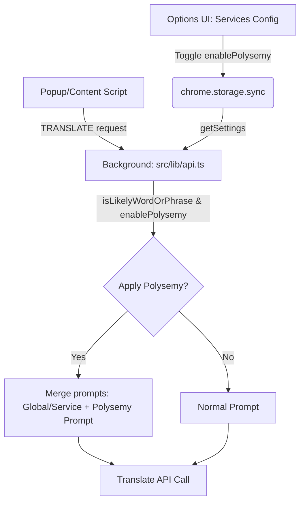

# Design Spec: Polysemy Translation Service Configuration

This specification details the implementation of turning "Polysemy Translation" into a translation service-level configurable setting in the browser translator extension.

## 1. Background

Previously, the translator extension automatically detected if the input text was a single word or a short phrase (likely a polysemous word) via `isLikelyWordOrPhrase` inside the popup translation context. When detected, it appended a dictionary-style explanation prompt (`buildPolysemyPrompt`) to the translation request.

To provide granular control, this feature will be refactored into a per-service level configuration toggle. When enabled for a specific translation service, the polysemy prompts will be automatically combined with the service-specific or global translation prompts within the background translation handler.

## 2. Requirements & Success Criteria

1. **Service Settings Property**: Every translation service (`TranslationService`) will gain an `enablePolysemy` boolean property (defaults to `false`).
2. **Schema Compatibility**: Zod configuration schemas must gracefully handle existing service configurations, populating `enablePolysemy: false` by default without breaking.
3. **Common Prompts Module**: Extraction of `isLikelyWordOrPhrase` and `buildPolysemyPrompt` out of `popup/main.tsx` into `src/lib/prompts.ts` for clean reusability between the popup and the background service.
4. **Intelligent Prompt Assembly**: 
   - If a service has `enablePolysemy` enabled, and the input text is a word/phrase, construct the polysemy prompt.
   - Append this polysemy prompt to the service-specific prompt (if set) or the global prompt (if no service prompt is set).
5. **Interactive UI Configuration**:
   - Provide an elegant switch toggle in the Option page's Service settings under the Collapsible Advanced Config Accordion.
   - Display a distinct Emerald "多义词翻译" badge on services in the service list when enabled.

## 3. Detailed Architecture & Proposed Changes



### 3.1 Data Schema
Add the Zod validation and types:
- `src/types/index.ts`: Update `BaseService` with `enablePolysemy?: boolean`.
- `src/lib/schema.ts`: Update `baseServiceSchema` with `enablePolysemy: z.boolean().default(false)`.

### 3.2 Public Helpers & Prompts
Move helper functions from `src/entrypoints/popup/main.tsx` into `src/lib/prompts.ts`:
- `isLikelyWordOrPhrase(text: string): boolean`
- `buildPolysemyPrompt(targetLang: string): string`

### 3.3 Prompt Combination (`src/lib/api.ts`)
Update the `translate` method in the background api logic. 
Locate the prompt construction block:
```typescript
let basePrompt = settings.globalPrompt;
const isWordOrPhrase = isLikelyWordOrPhrase(text);
const shouldApplyPolysemy = activeService.enablePolysemy && isWordOrPhrase;
const polysemyPrompt = shouldApplyPolysemy ? buildPolysemyPrompt(targetLang) : '';

if (activeService.prompt?.trim()) {
  const servicePrompt = activeService.prompt.trim();
  const isOverride = activeService.promptMode === 'override';
  if (isOverride) {
    basePrompt = servicePrompt;
  } else {
    basePrompt = `${settings.globalPrompt}\n\nAdditional translation instructions for this service:\n${servicePrompt}`;
  }
}

if (shouldApplyPolysemy) {
  basePrompt = `${basePrompt}\n\n${polysemyPrompt}`;
}
```

### 3.4 Service UI Settings (`src/components/options/services-settings.tsx`)
- In `handleAdd`, include `enablePolysemy: false` to initialize new services correctly.
- Add the Polysemy switch switch toggle under `services-settings.tsx` Collapsible Advanced Config (below the custom prompt `Textarea`):
  ```tsx
  <div className="flex items-center justify-between pt-2 border-t border-border/50">
    <div>
      <div className="text-sm font-medium">启用多义词词典式翻译 (Polysemy)</div>
      <div className="text-xs text-muted-foreground">当输入为单个词或短语时，自动提供词性、多义项对比及英文音标释义</div>
    </div>
    <button
      type="button"
      onClick={() => setEditingService({
        ...editingService,
        enablePolysemy: !editingService.enablePolysemy
      })}
      className={cn(
        'relative inline-flex h-6 w-11 items-center rounded-full transition-colors',
        editingService.enablePolysemy ? 'bg-indigo-500' : 'bg-muted'
      )}
    >
      <span
        className={cn(
          'inline-block h-4 w-4 transform rounded-full bg-white transition-transform',
          editingService.enablePolysemy ? 'translate-x-6' : 'translate-x-1'
        )}
      />
    </button>
  </div>
  ```
- In the service list card view, render a visual badge if `service.enablePolysemy` is enabled.
  ```tsx
  {service.enablePolysemy && (
    <Badge variant="outline" className="text-[9px] px-1.5 text-emerald-500 border-emerald-200/50 bg-emerald-500/5">
      多义词翻译
    </Badge>
  )}
  ```

## 4. Verification Plan

1. **Compile Check**: Run `bun compile` to ensure Zod parsing and TypeScript properties have zero compilation errors.
2. **Configuration Load/Save Verification**:
   - Create a new service and toggle "Polysemy Translation" on. Save and verify it persists and updates properly.
   - Verify existing services load correctly without schema errors, defaulting to `false`.
3. **Translation Prompt Injection Verification**:
   - Use the popup translation, input a single word (e.g. "bank"). Confirm the translated output contains a dictionary-style multi-sense layout with bullet points.
   - Input a long sentence. Confirm it returns a normal sentence translation without bullet points.
   - Toggle the Polysemy option off. Confirm a single word "bank" receives standard translation without bullet points.
